# `Gjallarhorn`

Gjallarhorn is a tool for Brawlhalla community tournament organizers to generate properly formatted JSON for Twitch overlays. Gjallarhorn can generate JSON for multiple use cases, including tickers, casters, lower thirds, queues, players, and games. It pulls data from start.gg as well as Brawlhalla's Stats API.

## Getting Started

You will need a start.gg API key to use Gjallarhorn. If you don't have one already, get one at https://developer.start.gg/docs/authentication.

To start Gjallarhorn, run the following commands in the project:

```
npm run build
node . -s [your-startgg-key-here]
```

Then, launch the dashboard at http://localhost:3000.

<details>
  <summary>Usage</summary>

You will find 6 different cards on the dashboard: Casters, Game, Ticker, Players, Queue, and Lower Thirds. You can fill out the cards with the details you want on the overlay and hit "Push". You will find the output files served over http at http://localhost:3000/api/json or the raw JSON files in `packages/cli/output`.

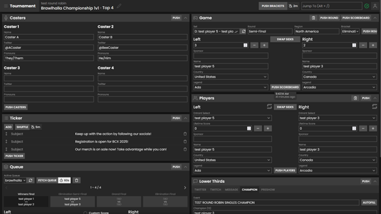

You can reorder the cards by dragging the title bar. A dotted line will show where the card will be placed.

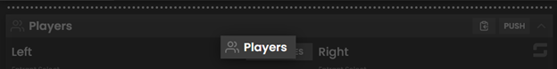

You can also recolor each card by right clicking on the title bar.

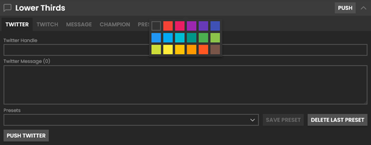

If a card is unnecessary or temporarily unneeded, you can minimize it by clicking the arrow at the right of each card next to the push button.

These JSON files can be connected to broadcasting software (vMix or OBS with applicable plugins) to allow for seamless editing and usage of data. However, not all of this data will be useful or even applicable to all organizers, and you can decide what data you'd like to use. Feel free to disregard any of the forms or data that are unnecessary for your production environment.

</details>

<details>
  <summary>Header</summary>

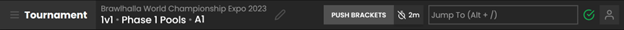

In the top left corner, the current tournament is indicated next to the hamburger menu. The pencil icon opens a text box where you can change the active tournament. Enter the tournament’s unique slug (“brawlhalla-world-championship-expo-2023”) to switch to that tournament. Shorthand forms also exist for certain tournaments (“bcx”). Clicking on the game mode (In this example, Brawlhalla Championship 1v1) allows you to switch between different tournament game modes if they exist. The pools can also be swapped similarly.

Push Brackets will output a JSON file to be used in bracket images. You can have these pushed every two minutes by clicking the timer next to the button.


Hovering over the checkmark icon next to the search bar shows you the application latency and the rate limits for both the database and start.gg.

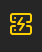

If your Gjallarhorn instance is unexpectedly terminated, the icon will change and turn yellow.


Hovering over this icon will show checkboxes that enable light mode and push notifications for possible errors respectively.

</details>

<details>
  <summary>Casters</summary>

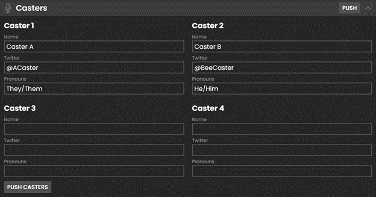

You can enter up to four different casters, with text boxes for their name, social media accounts, and pronouns.

</details>

<details>
  <summary>Game</summary>

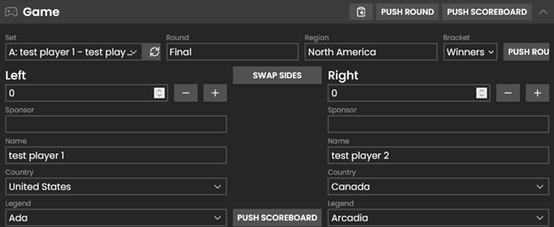

This card can be input manually, or you can use the Set dropdown to populate text with a start.gg match. You can also import a set from the Queue card by clicking on the clipboard next to Push Round. Rounds won can be incremented using the plus and minus buttons next to Left and Right.

</details>

<details>
  <summary>Players</summary>

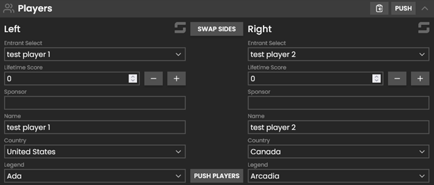

This card can be input manually. You can also import players from the Game card or the Queue card with the clipboard button next to Push. When importing players, Gjallarhorn will attempt to populate the Lifetime Score textbox with information from the Stats API. It can also be manually incremented with the plus and minus buttons. The legend loaded for each player will be the most recently reported legend in the current tournament (if applicable). Otherwise, it will be the last legend the player ever reported.

</details>

<details>
  <summary>Ticker</summary>

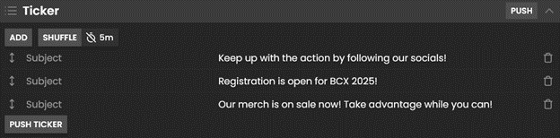

Used to create tickers (as the name implies). These tickers can be manually moved by dragging the vertical arrow icon next to the subject, and can be randomly shuffled by hitting the shuffle button. By clicking the timer next to shuffle, the tickers will automatically shuffle every five minutes.

</details>

<details>
  <summary>Queue</summary>

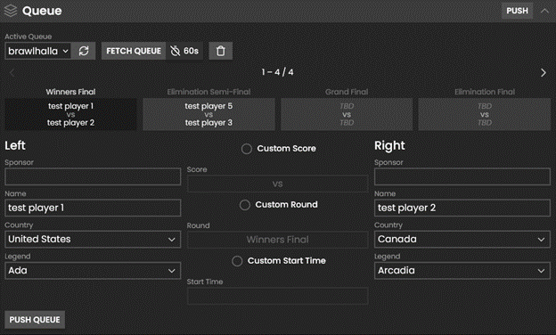

The Queue card pulls queues from a start.gg tournament. In order for this card to be useful, your tournament must have at least one active queue. You can continuously fetch the currently active queue every sixty seconds by clicking the timer next to Fetch Queue.

</details>

<details>
  <summary>Lower Thirds</summary>

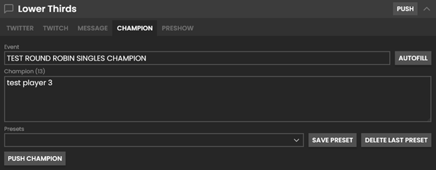

The Lower Thirds card has five sections: Twitter, Twitch, Message, Champion, and Preshow.

Champion can be autofilled by clicking the autofill button. It will use the tournament name along with the game mode, and the winner’s name will be in the message box.

You can create presets for each section. You can also delete the most recently created preset if it was added in error.

</details>

## Development Overview

Gjallarhorn consists of a React front end and a NodeJS backend. The NodeJS
backends act as data stores for the data input into the cards. Backend updates
from `setState`are published over the websocket to the front end for display
purposes (like results of calls for start.gg). The front end can also subscribe
to those updates by calling `backend.useState([StateKeyHere])` and publish new
updates itself. This mirrors React's `useState` hook.

Both are compiled separately, so be aware that you should NOT import any server
files into the client, and vice versa. You'll see a pattern like this:

```
import { useBackend } from "../../../client/support/backend";
import { GameBackend } from "../../../backends/cards/game";
import { TGameBackend } from "@bmg-esports/gjallarhorn-tokens";

function CoolComponent() {
  const b = useBackend<GameBackend>(TGameBackend);
  ...
}
```

Which works because GameBackend is being used as a type, which gets discarded
upon compilation.

But this will not work:

```
import { GameBackend } from "../../../backends/cards/game";

function CoolComponent() {
  const b = new GameBackend();
  ...
}
```

Nor this:

```
import { GameBackend } from "../../../backends/cards/game";

function CoolComponent() {
  const b = useBackend(GameBackend);
  ...
}
```

**Errors:** All errors are treated as fatal even though they won't crash the
app. We publish the errors to the operator and give the user the option to mark
them as non-fatal and pause the tournament, or default to a meaningful value
(like if start.gg does not return a value for a field)

**Project Structure:** Core contains the meat of Gjallarhorn. You will find card
UI built from React components in `src/client/pages/cards` and their respective
backends in `src/backends`. Reusable UI elements are grouped in `src/client/ui`.
The networking layer is found in `src/services`, like the one to the Brawlhalla
Stats API (`db.ts`)

## Contributors

[](https://github.com/preyneyv)
[](https://github.com/arnabp)
[](https://github.com/BuildGayFromSource)
